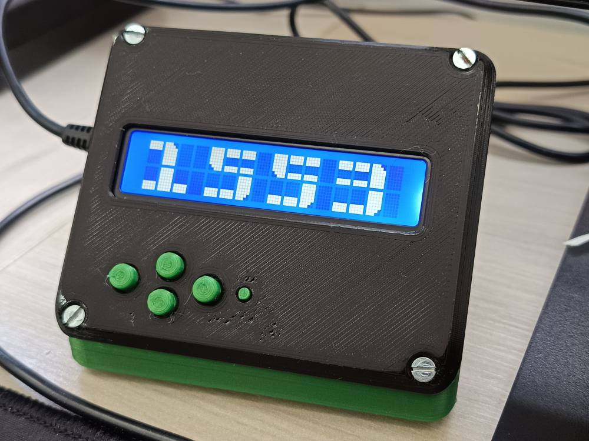
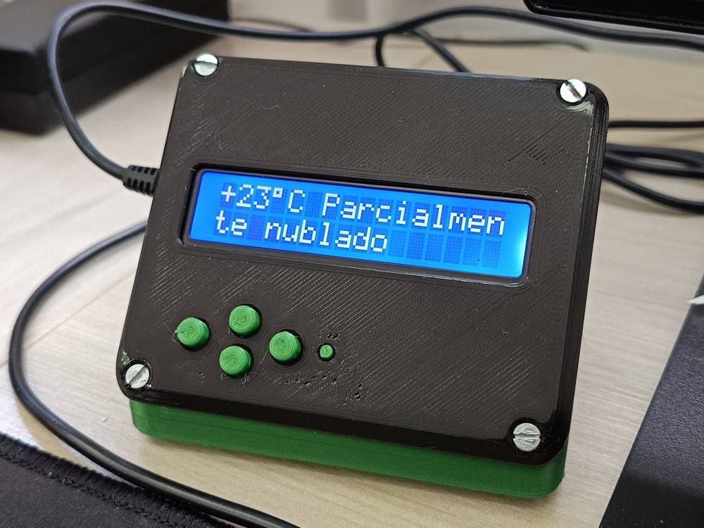

# NTP Clock with Weather Display for ESP8266



---

## Overview

This project uses an **ESP8266 microcontroller** (Wemos D1) to create a **Network Time Protocol (NTP) clock** with a **weather display**. The clock fetches the current time from an NTP server and displays it on a **16x2 LCD screen**. Additionally, it retrieves the weather information for a specified location (Curitiba) via the **wttr.in** service and displays the temperature and condition on the second line of the LCD. The device connects to Wi-Fi and syncs with an NTP server for time updates.

## Features

- Connects to a Wi-Fi network from a predefined list of SSIDs.
- Synchronizes the time with an NTP server.
- Displays the current time (hour, minute, second) on the LCD.
- Displays the current date and day of the week.
- Fetches and displays the current weather (temperature and condition) from **wttr.in**.
- Supports basic button inputs for navigating between different displays (Network, NTP, Date, Weather).

## Hardware

- **ESP8266 (Wemos D1)** microcontroller
- **16x2 LCD Keypad Shield**

## Libraries Used

- **ESP8266WiFi.h** - Wi-Fi support for the ESP8266
- **ESP8266HTTPClient.h** - HTTP requests for weather data retrieval
- **NTPClient.h** - NTP client for time synchronization
- **WiFiUdp.h** - UDP communication (used by NTPClient)
- **WiFiClientSecure.h** - Secure HTTP (HTTPS) requests
- **LiquidCrystal.h** - Controlling the LCD display
- **wifi_credentials.h** - Custom header for storing Wi-Fi credentials
- **digits.h** - Custom header for displaying big digits on the LCD

## Setup Instructions

1. **Install the necessary libraries**:
   - Go to **Sketch** > **Include Library** > **Manage Libraries...**
   - Install the following libraries:
     - **ESP8266WiFi**
     - **ESP8266HTTPClient**
     - **NTPClient**
     - **LiquidCrystal**
   
2. **Configure Wi-Fi Credentials**:
   - Create a file named `wifi_credentials.h` and include it in the project.
   - Inside `wifi_credentials.h`, define your Wi-Fi SSID and password:
     ```cpp
     const char* ssids[] = { "YourWiFiSSID1", "YourWiFiSSID2" };
     const char* passwords[] = { "YourWiFiPassword1", "YourWiFiPassword2" };
     ```
   
3. **Upload the Code**:
   - Open the Arduino IDE, select the **Wemos D1** board under **Tools** > **Board**.
   - Select the correct port under **Tools** > **Port**.
   - Upload the code to the ESP8266.

4. **Connecting to Wi-Fi and NTP**:
   - The device will attempt to connect to one of the specified Wi-Fi networks and then synchronize with an NTP server to get the current time.

5. **Weather Data**:
   - The device fetches weather information from **wttr.in** for the city of Curitiba. You can modify the `weatherUrl` to change the location if desired.

6. **Buttons**:
   - Use the buttons on the LCD keypad shield to cycle through different screens:
     - **Network**: Displays IP address and connected Wi-Fi SSID.
     - **NTP**: Shows the current NTP server and synchronized time.
     - **Date**: Shows the current date and day of the week.
     - **Weather**: Displays the current temperature and weather condition.

## Wiring

- **Wemos D1**:
  - **LCD Pins**:
    - `D8` -> `RS` (Register Select)
    - `D9` -> `Enable`
    - `D4` -> `D4`
    - `D5` -> `D5`
    - `D6` -> `D6`
    - `D7` -> `D7`
  - **Button Pins**:
    - `A0` -> Button Input

## 3D Printed Enclosure

In the folder Enclosure-3D I included files for 3D printing a compatible case.
Case for Arduino Uno, LCD Keypad Shield and Stepper Motor Driver by AndreySamokhin on Thingiverse: https://www.thingiverse.com/thing:4194107 and is licensed under Creative Commons - Attribution - Share Alike




## Troubleshooting

- **Wi-Fi Connection Issues**:
  - Ensure that the SSID and password are correctly defined in `wifi_credentials.h`.
  - Ensure that your Wi-Fi network is stable and the ESP8266 is within range.

- **NTP Server Connection**:
  - If the NTP server connection fails, the device will attempt to connect to other predefined NTP servers. Ensure that the device has internet access.

- **Weather Data Issues**:
  - If the weather data is not displayed, check the Wi-Fi connection and ensure that the **wttr.in** URL is accessible.

## License

This project is licensed under the **GNU General Public License (GPL)**. Feel free to modify and distribute it, but please ensure that any modifications or distributions also adhere to this license.

## Acknowledgments

- **ESP8266** library and documentation.
- **LiquidCrystal** library for LCD display support.
- **wttr.in** service for providing simple weather information.
- **[steemit](https://steemit.com/utopian-io/@lapilipinas/arduino-big-digits-0-99-with-i2c-16x2-lcd)** for the example big number code
- **[kolandor](https://github.com/kolandor/LCD-Keypad-Shield-Wemos-D1-Arduino-UNO)** - His code shows how to use the LCD Keypad Shield with thee Wemos D1. Even not using it directly, reading the source ended hours of frustrating debugging.


